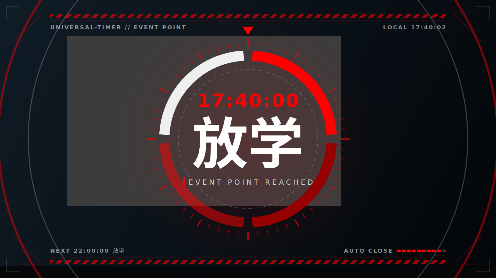

# 事件点全屏提醒 · Qt 实现

网页演示（`../event-point-reminder/index.html`）的 Qt 版本，逐帧效果一致。整窗用 `QPainter` 绘制，由一条 `QVariantAnimation` 时间轴驱动。



## 文件

| 文件 | 说明 |
| --- | --- |
| `src/ui/EventPointFullscreenReminder.h/.cpp` | 全屏提醒类，可直接放进 Universal-Timer 的 `src/ui/` |
| `integration.patch` | 对 Universal-Timer 当前 `main` 的完整补丁（新增上面两个文件 + 接线） |
| `demo/main.cpp`、`CMakeLists.txt` | 独立预览程序，不依赖主程序 |
| `src/core/EventPoint.h` | 从主程序复制，供独立预览编译用 |
| `sounds/countdown.wav` | 从主程序复制，提示音 |

## 接入 Universal-Timer

**不会用 git 的话**：用 `one-click/` 里的一键应用包（Windows）。把整个文件夹放进 Universal-Timer 项目文件夹，双击 `apply.bat`，再在 Qt Creator 里重新运行 CMake 即可；双击 `undo.bat` 撤销。它做的修改与下面的补丁逐字节相同，改之前会备份原文件；如果项目代码和预期对不上，会提示是哪一步，并且一个文件都不改。

**会用 git 的话**，在 Universal-Timer 仓库根目录：

```bash
git apply path/to/qt/integration.patch
```

补丁一共改四处：

1. 新增 `src/ui/EventPointFullscreenReminder.h/.cpp`，并加进 `src/CMakeLists.txt`。
2. `EventPointReminder` 新增信号 `reached(const EventPoint&, const QRect& capsuleGeometry)`。
3. `EventPointReminder::updateLabel()` 在 `remainingSeconds <= 0` 时停止计时、发出 `reached`（带上胶囊此刻的位置）、隐藏并 `deleteLater()`。原来“显示名称 → 1 秒后收起”的分支删掉了，收起动作由全屏提醒接着画。
4. `UniversalTimer2::updateObjects()` 创建胶囊时连接 `reached`，用 `config.event_point.event_point_list` 创建全屏提醒并 `start()`：

```cpp
connect(event_point_reminder, &EventPointReminder::reached, this, [this](const EventPoint& event_point, const QRect& capsule_geometry) {
    EventPointFullscreenReminder* event_point_fullscreen_reminder = new EventPointFullscreenReminder(event_point, config.event_point.event_point_list, capsule_geometry);
    event_point_fullscreen_reminder->start();
    });
```

构造参数：

```cpp
EventPointFullscreenReminder(const EventPoint& eventPoint,
                             const QList<EventPoint>& eventPointList = {}, // 用来显示“下一个事件点”
                             const QRect& capsuleGeometry = QRect(),       // 红线起点，空则用默认位置
                             int flashTimes = 3,                           // 闪烁 / 提示音次数
                             QWidget* parent = nullptr);
```

窗口属性与 `FullscreenPagesManager` 相同（无边框、置顶、`Tool`、透明背景），另外加了 `WA_ShowWithoutActivating`（不抢焦点）和 `WA_DeleteOnClose`（播完自动释放）。提示音和 `ReminderPage` 一样读 `./sounds/countdown.wav`。播放中点击屏幕会直接进入收尾淡出。

## 独立预览

```bash
cmake -S qt -B build
cmake --build build
cd build && ./EventPointReminderDemo                 # 在主屏播放一次
./EventPointReminderDemo --loop                      # 循环
./EventPointReminderDemo --name 午休结束 --time 12:30:00 --flash 2
./EventPointReminderDemo --dump frames --size 1920x1080   # 不弹窗，把关键帧存成 PNG
```

Windows 上用 Qt Creator 直接打开 `qt/CMakeLists.txt` 也可以。

## 实现要点

- **一条时间轴**：`m_timeline`（`QVariantAnimation`，0 → 总时长，线性）只负责更新 `m_t` 和 `update()`。每个图层在 `paintEvent` 里用 `QEasingCurve::valueForProgress()` 算自己的局部进度，所以 `seek(ms)` 可以停在任意一帧。
- **尺寸**：全部按 `m_unit = min(屏高, 屏宽 × 9/16)` 换算，1080p 下与网页演示的像素值一致。胶囊红边保持 5px，与 `EventPointReminder` 相同。
- **角度**：设计里以 12 点钟为 0°、顺时针；`drawArc` 以 3 点钟为 0°、逆时针为正、单位 1/16°，换算写在 `drawRing()` 里。
- **虚线**：`QPen::setDashPattern` 和 `setDashOffset` 都以笔宽为单位，代码里已经除以笔宽。
- **V 形红门上的字**：每扇门先 `setClipPath(门)` 再 `drawText`，两扇门各画一次，字就被接缝切开并跟着门走。
- **淡出**：用 `painter.setOpacity()` 实现，效果等同 `FadeOutAnimation`（windowOpacity 1 → 0，1000ms，InCubic），而且 `--dump` 截图时也能生效。
- **字体**：数字和英文用 `DIN1451 → Bahnschrift → Barlow Condensed`，中文用 `zihun59hao-chuangcuhei → Microsoft YaHei UI`，与 `ReminderPage` 的顺序一致。

## 验证情况

- 独立预览程序在 Qt 6.4.2（Linux）下编译通过，无警告；用 `--dump` 渲染的关键帧与网页演示一致（上面的截图）。
- 打上补丁的 Universal-Timer 能完整编译链接，并实际运行过一次：把一个事件点设在几秒后，全屏提醒在事件时间准点开始，6.5 秒后正常结束，没有崩溃。
- 说明：主程序 `SettingsContent.cpp` 用到 `QCheckBox::checkStateChanged`（Qt 6.7+），在 6.4 下编不过，与本补丁无关；验证时临时替换了这一行，补丁里没有包含这个改动。
